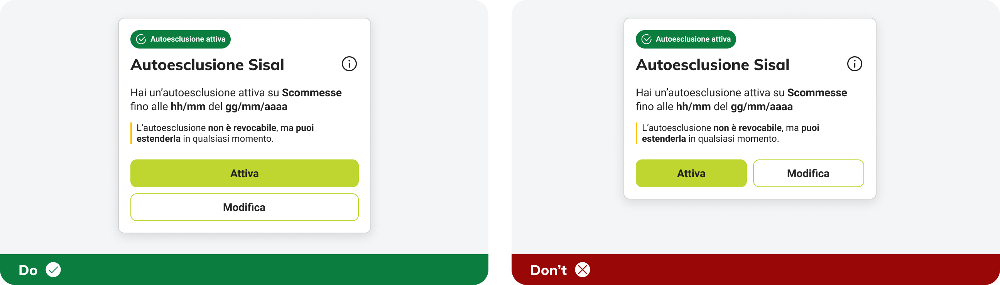
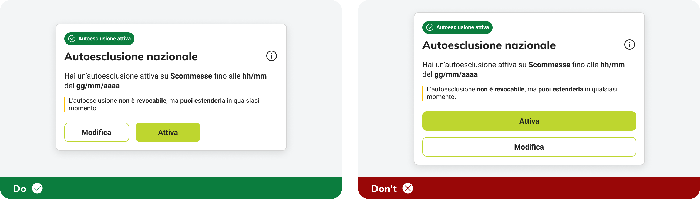
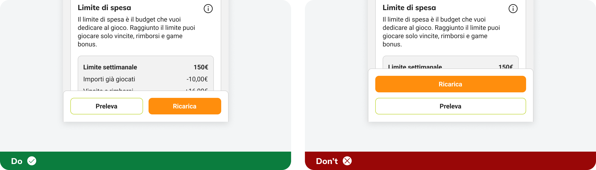
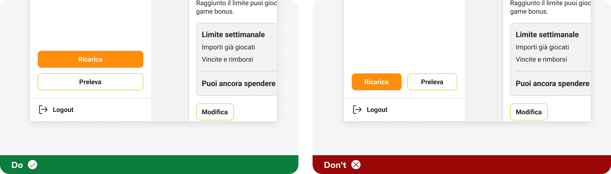
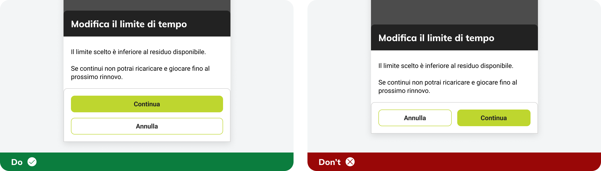
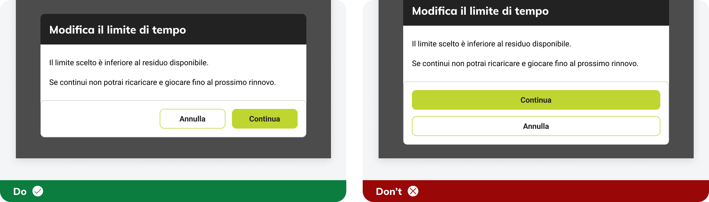
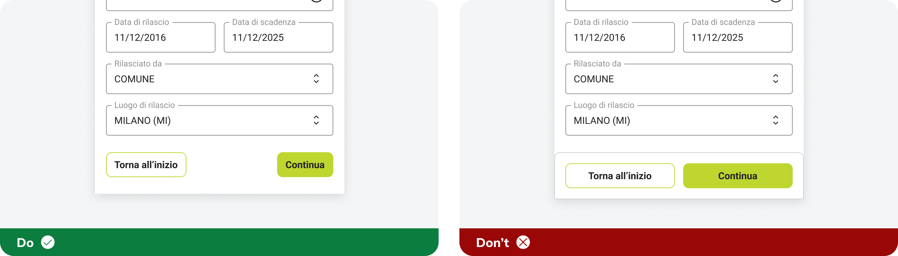
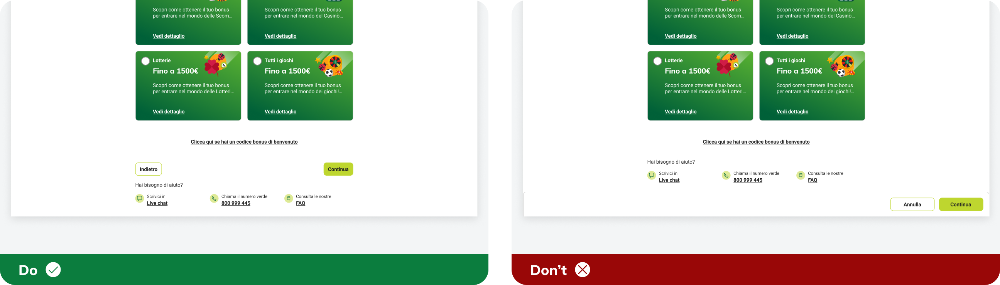

# Behavior
Defines how the component works, including interaction rules and conditional logic.

---

## Button group

### Mobile

### Desktop

---

## Buttons group - Reserved Area

The button sticky group stays anchored to the bottom and remains fixed while the page is scrolled. On desktop, it appears inside the menu.

### Mobile

### Desktop

---

## Button sticky group

The button sticky group stays anchored to the bottom and remains fixed while the modal is scrolled.

### Mobile

### Desktop

---

## Button process

Placed at the bottom of the page after the content; not sticky.

### Mobile

### Desktop

