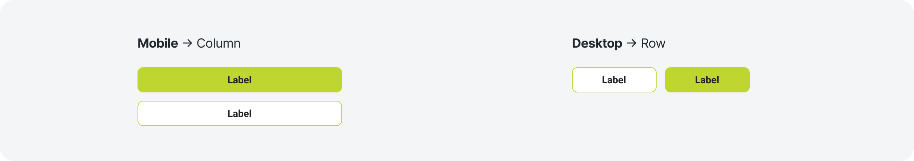
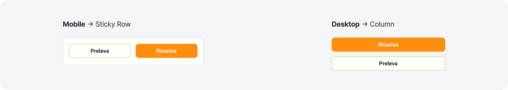
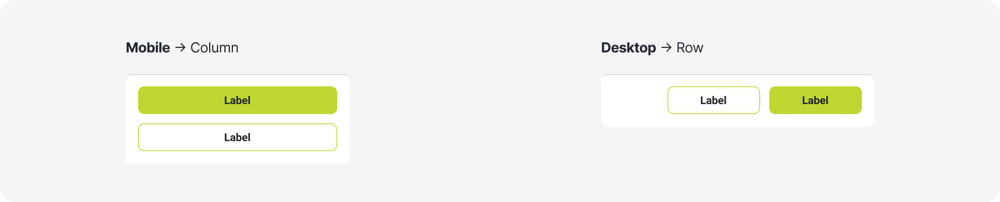
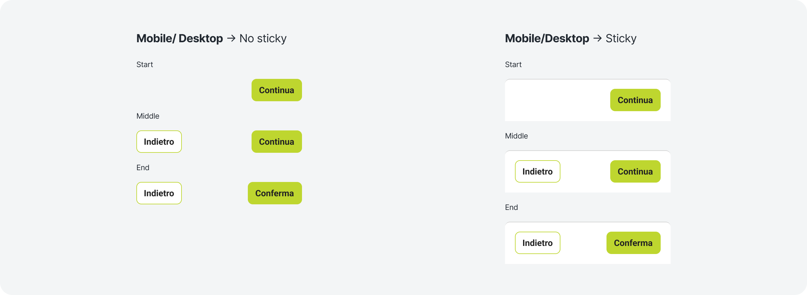

# Purpose & Usage
What it is, and when and why to use this component.

---

## Buttons group

### When and why to use

The button combo can be configured with one or two CTAs based on the context. For important actions, use a primary button to draw attention. When two buttons are needed, pair a primary button with a secondary button to clearly distinguish the main action from the secondary option.

Use it in:
- Card
- Widget

---

## Buttons group - Reserved Area

### When and why to use

This button group is used in the Reserved Area for the "Withdraw" and "Deposit" CTAs.
Compared to the standard button group, it behaves as a sticky row on mobile and as a column on desktop.

Use it in:
- Reserved area

---

## Buttons sticky group

### When and why to use

The button sticky combo can be configured with one or two CTAs based on the context.

Use it in:
- Modals

---

## Buttons process

### When and why to use

The button group process is configured in a process flow.

In the final CTA, all flows use "Conferma", except for registration, which uses "Registrati".

Use it in:
- Modals/Pages of a process flow (Deposit flow, Registration flow, Recovery password, ...)

