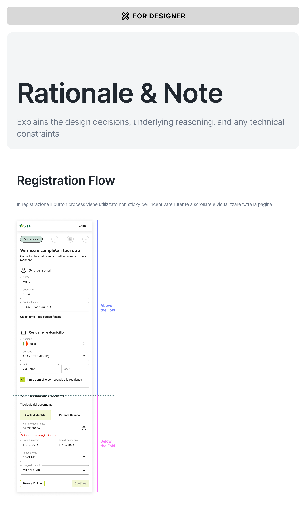

# Rationale & Note
Explains the design decisions, underlying reasoning, and any technical constraints.

---

## Registration Flow

In registrazione il button process viene utilizzato non sticky per incentivare l'utente a scrollare e visualizzare tutta la pagina.

